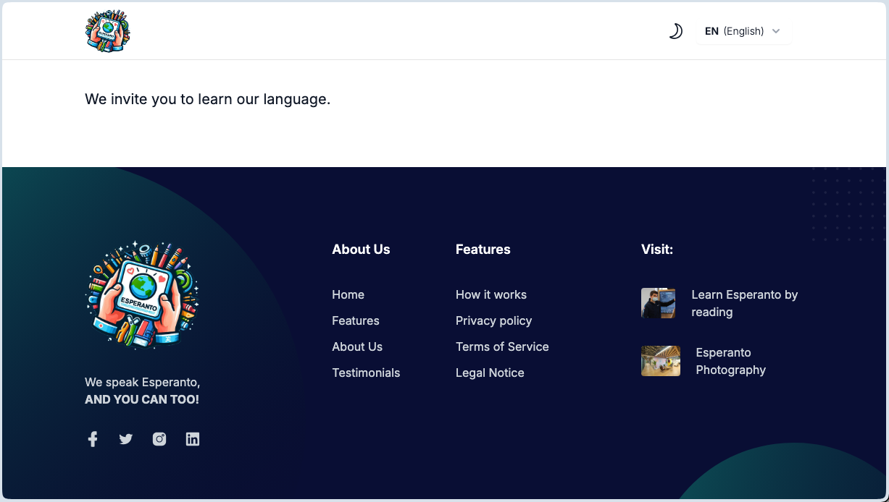
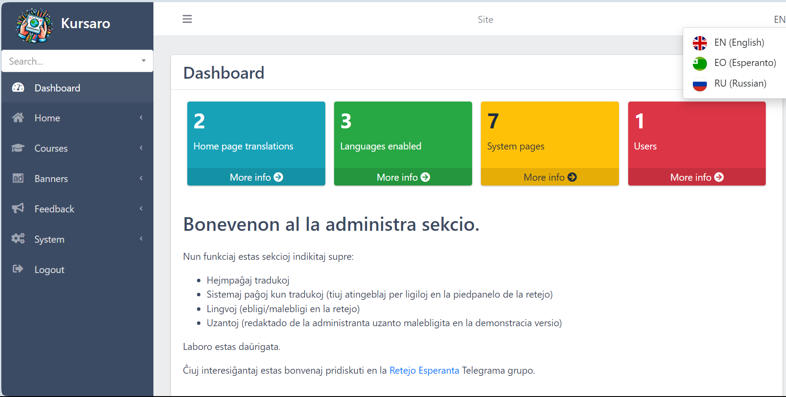

## Kursaro

Kursaro estas informa projekto por prezenti ĝeneralajn informojn pri Esperanto (same kiel - eble - iu alia lingvo, aŭ io ajn tiusence) kun informoj (ligiloj) pri lingvaj kursoj, kiujn ret-vizitantoj povas uzi por studi la lingvon.

Fronte:

Malfronte:

## Demo retejo

Oni povas viziti kaj esplori [Demo retejon](https://kursaro.esperantejo.com) por vidi progreson.

Por eniri Administran parton de la retej, bv. viziti la [/login](https://kursaro.esperantejo.com/login) ligilon kaj enmeti la akreditaĵojn:

- poŝtadreso - admin@admin.com
- pasvorto - password

## [Kial ĉio startis](docs/eo/gxenerala.md)

## Teknologioj

La sistemo estas programato uzante

- [Laravel (version 11)](https://laravel.com),
- [Tailwind CSS](https://tailwindcss.com),
- [Laravel Blade](https://laravel.com/docs/11.x/blade) por ŝablonoj,
- [Alpine.js](https://alpinejs.dev/) kaj JavaScript por interaktiveco,
- [Google Bootstrap](https://getbootstrap.com) en la malfronta parto (simple pro tradiciaj kialoj, legu plu [Ŝablonoj](docs/eo/sxablonoj.md)),
- [CKEditor](https://ckeditor.com/) kiel viza redaktilo,
- [Datatables](https://datatables.net) por manipuli datumojn en maldekstro,
- [Spatie Laravel Media Library](https://spatie.be/docs/laravel-medialibrary/v11/introduction) por konservi kaj prezenti grafikaĵojn,
- Daŭrigota...

Preferata estas maluzo de eksteraj pakaĵoj por eviti problemojn kiam tiuj estas forlasitaj kaj ne plu funkcias. En la nuna etapo tiuj estas uzataj por pli rapide veni al funkcianta retejo, estonte eble estos ŝanĝitaj favore al propra evolvo.

## Dokumentaro

Dokumentaro estas preparata en la **/docs** dosierujo, kas sub tio - laŭlingve.

Nun estas aldonitaj kelkaj klarigoj en Esperanto, do la dosierujo troviĝas ĉe **/docs/eo**

## Instalado

[Instalado](docs/eo/instalado.md) (almenaŭ por nun) estas standarta Laravel instala proceduro sekvinda por diponejoj, prenitaj de Github.

Mi uzis SQLite por databazo, tio helpas eviti instaladon de databazaj serviloj en gastigejo.

Se vi volas uzi aliun databazon kiel MySQL, MariaDB aŭ PosgreSQL, metu rilatajn agordojn en via **.env** dosiero, kaj post tio normale preparu databazon per migradoj kaj instalu komencaj datumoj per semiloj.

Nenio nestandarta.

## Kotaktoj

- [Diskuto kaj informoj - en la Telegram-grupo "Retejo Esperanta"](https://t.me/retejoesperanta)
- [Andreo Gotema Telegrama kontakto](t.me/sirandrewgotham)
- [Retpoŝto](mailto:andreogotema@gmail.com)
- [Votsapo](https://wa.me/+77755569244); bonvolu noti, ke telefonpetoj de nekonataj numeroj malofte ricevas respondon, prefere skribu en Votsapo por kontakti. Ankaŭ, internaciaj pagendaĵoj al Kazaĥio povas esti aldonataj
- [Github koda disponejo](https://github.com/sirandrewgotham/kursaro)

## Kometoj, kritikoj kaj petoj

Ĉiuj viaj komentoj kaj kritikoj estas gravaj kaj bonkore akceptataj per iu de supraj kontaktoj.

Se vi volus kunlabori, aŭ planas uzi la sistemon en via retejo kiam estos preta, tamen havas ideojn pri funkciado bezonata, bonvolu nepre kontakti min por pridiskuti per iu de supraj kontaktoj.

Sincere,   
Andrew Gotema

