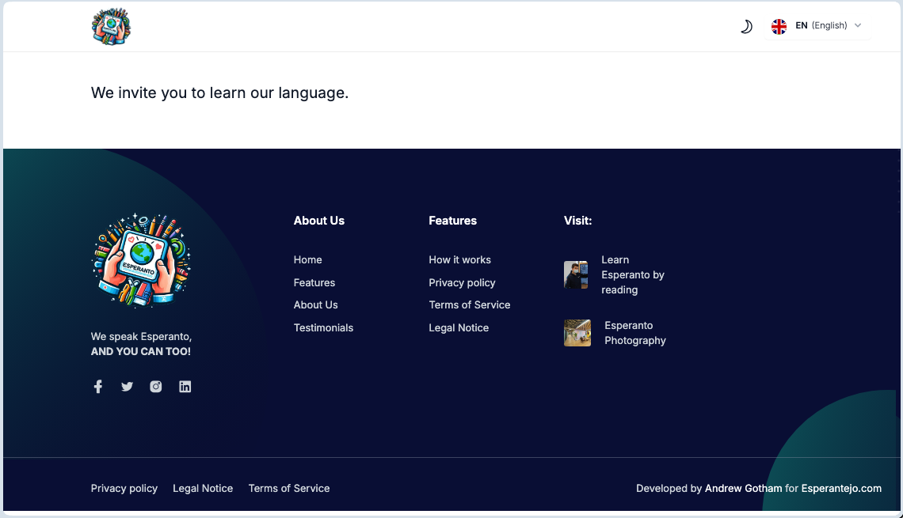

## Kursaro

Kursaro estas informa projekto por prezenti ĝeneralajn informojn pri Esperanto (same kiel - eble - iu alia lingvo) kun informoj (ligiloj) pri lingvaj kursoj, kiujn ret-vizitantoj povas uzi por studi la lingvon.

[Kial ĉio startis](docs/eo/gxenerala.md)

## Teknologioj

La sistemo estas programato uzante

- [Laravel (version 11)](https://laravel.com),
- [Tailwind CSS](https://tailwindcss.com),
- [Laravel Blade](https://laravel.com/docs/11.x/blade) por ŝablonoj,
- [Alpine.js](https://alpinejs.dev/) kaj JavaScript por interaktiveco,
- Google Bootstrap en la malfronta parto (simple pro tradiciaj kialoj, legu plu [Ŝablonoj](docs/eo/sxablonoj.md)),
- [CKEditor](https://ckeditor.com/) kiel viza redaktilo,
- Daŭrigota...

Preferata estas maluzo de eksteraj pakaĵoj por eviti problemojn kiam tiuj estas forlasitaj kaj ne plu funkcias.

## Dokumentaro

Dokumentaro estas preparata en la **/docs** dosierujo, kas sub tio - laŭlingve.

Nun estas aldonitaj kelkaj klarigoj en Esperanto, do la dosierujo troviĝas ĉe **/docs/eo**

## Instalado

Instalado (almenaŭ por nun) estas standarta Laravel instala proceduro sekvinda por diponejoj, prenitaj de Github.

Mi uzis SQLite por databazo, tio helpas eviti instaladon de databazoj serviloj en gastigejo.

Se vi volas uzi alun databazon kiel MySQL, MariaDB aŭ PosgreSQL, metu rilatajn agordojn en via **.env** dosiero, kaj post tio normale preparu databazon per migradoj kaj instalu komencaj datumoj per semiloj.

Nenio nestandarta.

## Kotaktoj

- [Diskuto kaj informoj - en la Telegram-grupo "Retejo Esperanta"](https://t.me/retejoesperanta)
- [Andreo Gotema Telegrama kontakto](t.me/sirandrewgotham)
- [Andreo Gotema retpoŝta adreso](mailto:andreogotema@gmail.com)
- [Andreo Gotema contakto en Votsapo](https://wa.me/+77755569244); bonvolu noti, ke telefonpetoj de nekonataj numeroj malofte ricevas respondon, prefere skribu en Votsapo por kontakti. Ankaŭ, internaciaj pagendaĵoj al Kazaĥio povas esti aldonataj
- [Github koda disponejo](https://github.com/sirandrewgotham/kursaro)

## Kometoj, kritikoj kaj petoj

Ĉiuj viaj komentoj kaj kritikoj estas gravaj kaj bonkore akceptataj per iu de supraj kontaktoj.

Se vi volus kunlabori, aŭ planas uzi la sistemon en via retejo kiam estos preta, tamen havas ideojn pri funkciado bezonata, bonvolu nepre kontakti min por pridiskuti per iu de supraj kontaktoj.

Sincere,   
Andrew Gotema

